# LLM Router

[](https://github.com/SamVale29/llm-router/actions/workflows/ci.yml)
[](LICENSE)

## Route every AI request to the right model — transparently.

LLM Router is an explainable, policy-driven TypeScript router for choosing AI models by task, capabilities, cost, latency, privacy and reliability.

[Try the decision-only playground](https://samvale29.github.io/llm-router/) · [Read the architecture](docs/architecture.md) · [Read the operations checklist](docs/operations.md) · [Browse the release](https://github.com/SamVale29/llm-router/releases/tag/v0.1.0)

The demo does not call a provider and never asks for an API key. Its catalog uses clearly labeled illustrative values. Replace those values with observations from your own workload before production use.

## Thirty-second example

```ts
import { createRouter } from "@llm-router/core";
import { demoCatalog } from "@llm-router/catalog";

const router = createRouter({
  catalog: demoCatalog,
  policy: {
    version: "1.0.0",
    defaults: { strategy: { kind: "weighted-score" }, fallbackAllowed: true },
    routes: [
      {
        id: "code",
        when: { task: ["code-review", "debugging"] },
        require: { capabilities: ["structured-outputs"] },
        prefer: { tags: ["code"] },
        select: { strategy: { kind: "weighted-score" } },
      },
    ],
  },
});

const decision = await router.decide({
  messages: [{ role: "user", content: "Review this TypeScript function." }],
  hints: { task: "code-review" },
});

console.log(decision.selected?.modelId);
console.log(decision.explanation);
```

Use router.execute only after registering an adapter explicitly. The core never reads environment variables and never performs network calls in decision-only mode.

## Why it exists

Model selection usually grows into hidden conditionals. That makes a capability mismatch, price change, provider outage or privacy rule hard to see and harder to test. LLM Router turns the decision into a versioned policy:

- constraints are applied before optimization;
- unknown capabilities, prices and latency are not silently treated as support, zero or fast;
- every candidate includes elimination reasons, signals, scores and estimates;
- the same request fingerprint, catalog, policy and health state can reproduce a deterministic decision;
- replay, shadow mode and evaluation work without paid provider calls.

This is not a claim that one model is universally best. It is a mechanism for making a chosen policy explicit.

## How a decision is made

```mermaid
flowchart LR
  A[Request] --> B[Normalize]
  B --> C[Detect task]
  C --> D[Apply hard constraints]
  D --> E[Build candidates]
  E --> F[Score qualified candidates]
  F --> G[Select model]
  G --> H[Build fallback chain]
  H --> I[Explain decision]
  I --> J[Execute when enabled]
  J --> K[Observe outcome]
```



The decision object includes policy and catalog versions, a normalized request hash, selected model, fallback chain, candidate table, score breakdown, cost/latency estimates and warnings.

## YAML policy

```yaml
version: "1.0.0"
defaults:
  strategy: weighted-score
  fallbackAllowed: true

routes:
  - id: ocr
    when: { task: ocr }
    require:
      inputModalities: [image]
    select:
      strategy: cheapest-qualified
      candidates: [demo-vision]

  - id: translation
    when: { task: translation }
    select:
      strategy: cheapest-qualified

fallbacks:
  - from: demo-code-pro
    to: [demo-long-context, demo-economy]
    on: [rate-limit, timeout, unavailable]
```

Validate a file with:

```bash
pnpm install
pnpm exec llm-router validate policy.yaml
pnpm exec llm-router decide request.json --policy policy.yaml
```

The CLI also supports init, explain, serve, replay, eval run, eval compare, catalog validate and doctor.

## Strategies

The core includes rules, cheapest-qualified, fastest-qualified, weighted-score, priority, seeded random-weighted, round-robin and cascade. A custom strategy implements the exported RoutingStrategy interface.

Weighted scores are normalized so that higher is always better. Missing signals are surfaced in warnings and do not become claims about model quality.

## Adapters

The repository contains functional adapters for:

- OpenAI;
- Anthropic Messages;
- Google Gemini generateContent;
- OpenRouter;
- generic OpenAI-compatible endpoints.

Provider credentials are passed directly to an adapter by application code. Namespaced providerOptions preserve provider-specific features. Adapter contract tests use a simulated fetch and never call paid APIs in CI.

## Shadow, replay and evaluation

Shadow mode computes alternative decisions without duplicating a prompt call:

```ts
const comparisons = await router.shadow(request);
```

Set executeShadowRequests only when real shadow calls are explicitly authorized. Replay reads anonymized JSONL traces and compares a candidate policy in decision-only mode. The evaluation package writes JSON, Markdown, HTML and CSV and reports quality, cost, latency, fallback and constraint metrics together.

```bash
pnpm exec llm-router replay fixtures/traces/sample.jsonl --policy fixtures/policies/default.yaml
pnpm exec llm-router eval run --dataset fixtures/evals/tasks.jsonl --policy fixtures/policies/default.yaml --output reports/eval
```

## Local proxy

The optional proxy is localhost-oriented and content logging is disabled by default:

```bash
pnpm exec llm-router serve --policy policy.yaml --port 8787
```

It exposes /v1/chat/completions, /v1/responses, /v1/router/decide, /v1/router/explain, /v1/router/models, /health and /ready. Configure an internal token before exposing it beyond localhost. Do not host a public unauthenticated proxy.

## Packages

- @llm-router/core — typed contracts, normalization, constraints, strategies, resilience and explainability.
- @llm-router/catalog — versioned providers, models and source metadata.
- @llm-router/evals — decision-only evaluation and replay.
- @llm-router/cli — local commands.
- @llm-router/proxy — optional local compatible server.
- @llm-router/observability — optional OpenTelemetry-shaped hooks without coupling the core.
- @llm-router/adapter-openai, adapter-anthropic, adapter-google, adapter-openrouter and adapter-openai-compatible.
- @llm-router/testing — mock adapters and fixtures.

## Quality commands

```bash
pnpm format:check
pnpm lint
pnpm typecheck
pnpm catalog:validate
pnpm test
pnpm build
pnpm test:e2e
pnpm pack:check
```

`pnpm test:e2e` builds the playground before testing, so local runs never use a stale `dist/`. CI uses `pnpm test:e2e:ci` after its shared build. CI runs without paid provider calls. E2E uses the static playground. The catalog's public demo numbers are illustrative; they are not benchmarks or billing claims.

## Security and privacy

Prompts, responses, images, keys and authorization headers are not logged by the core. Request fingerprints are hashes, not reversible storage. Remote classification is not enabled by default. Read [SECURITY.md](SECURITY.md) before configuring a network adapter or proxy.

## Roadmap

v0.1 includes rules, score routing, capability filtering, adapters, explainability, CLI, proxy, playground, evaluation, replay and shadow decisions. v0.2 is planned for external health/budget stores and integrations. Experimental contextual bandits are deferred until workload evidence and opt-in controls are in place.

## Contributing

See [CONTRIBUTING.md](CONTRIBUTING.md), [GOVERNANCE.md](GOVERNANCE.md) and the issue templates. The project is independent; providers do not endorse it.

If LLM Router helps you ship a more reliable or cost-efficient AI application, consider starring the repository. It helps other developers find the project.

## License

Apache License 2.0. See [LICENSE](LICENSE).
